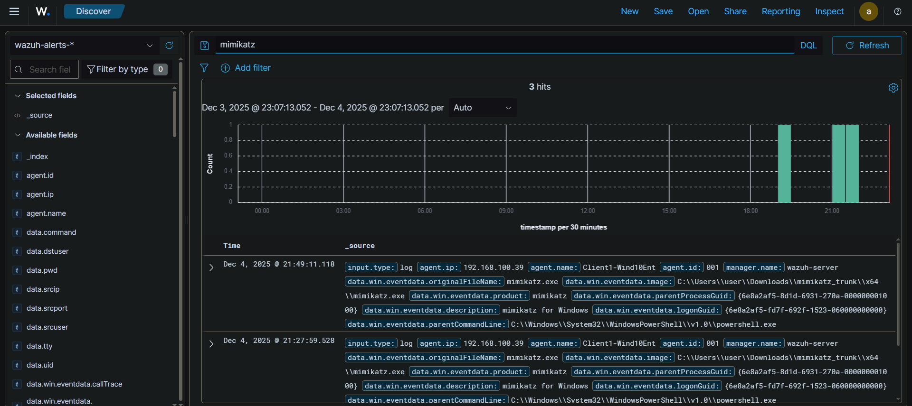
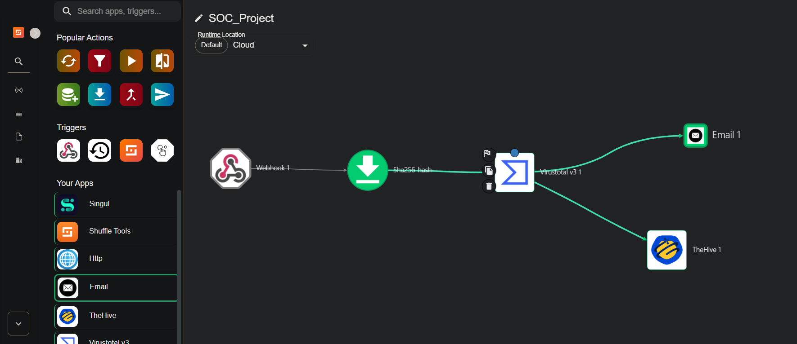
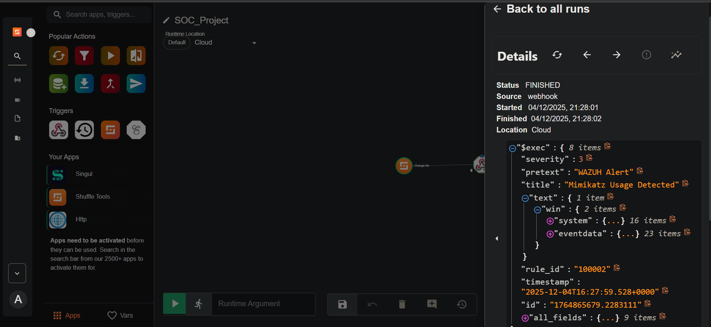
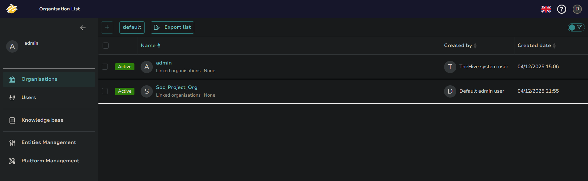
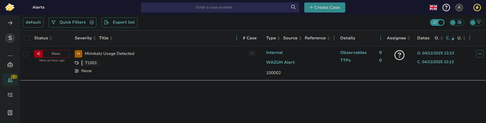

# SOC Automation Project

## Introduction

This project is a hands-on implementation of a **Security Operations Center (SOC) Automation Pipeline**. I built a fully functional Home Lab that simulates a real-world enterprise environment to detect, analyze, and respond to security threats automatically.

The goal was to move beyond simple monitoring and implement **SOAR (Security Orchestration, Automation, and Response)** capabilities. I integrated a SIEM (Wazuh) with an Incident Response Platform (TheHive) using a middleware automation tool (Shuffle) to handle threat intelligence enrichment.

## Architecture & Workflow

The pipeline follows this logic:

1. **Telemetry:** A Windows 10 endpoint sends logs to the Wazuh Manager.
2. **Detection:** Wazuh detects malicious activity (Mimikatz) and generates an alert.
3. **Orchestration:** Wazuh sends the alert payload to **Shuffle** via a Webhook.
4. **Enrichment:** Shuffle extracts the SHA256 hash from the alert and queries **VirusTotal**.
5. **Response:**
    - If the file is malicious, Shuffle creates an Alert in **TheHive**.
    - Simultaneously, an email notification is sent to the SOC Analyst.

---

## 🛠️ Tools Used

| Component | Tool | Purpose |
| --- | --- | --- |
| **SIEM** | **Wazuh** | Log collection, decoding, and threat detection. Hosted on a Cloud VPS. |
| **Endpoint** | **Windows 10** | The "victim" machine, monitored by the Wazuh Agent. |
| **Telemetry** | **Sysmon** | Provides granular event logging (Event ID 1, 3, etc.) that standard Windows logs miss. |
| **SOAR** | **Shuffle** | The automation engine connecting the SIEM to the Analyst. |
| **Case Mgmt** | **TheHive** | Where incidents are tracked, assigned, and investigated. |
| **Threat Intel** | **VirusTotal** | Used to verify the reputation of file hashes automatically. |


---

### Step-by-Step Implementation & Challenges

### Infrastructure Deployment

I architected a hybrid lab environment using local virtualization for the endpoint and Google Cloud Platform (GCP) for the server infrastructure.

**Lab Specifications:**

- **Endpoint:** Windows 10 Enterprise (Local VMware Workstation).
- **SIEM Server (Wazuh):** GCP `n2-custom-4-12288` (4 vCPU, 12 GB RAM) running Ubuntu 24.04 LTS.
- **SOAR Server (TheHive):** GCP `n4-standard-4` (4 vCPU, 16 GB RAM) running Ubuntu 24.04 LTS.

**Deployment Process:**
I deployed Wazuh and TheHive following their official documentation. This involved installing the prerequisites for TheHive manually, including Java, Cassandra (database), and Elasticsearch (indexer).

**Implementation Challenge: Network Connectivity & Interface Binding**
After starting TheHive services, the web interface on port 9000 was unreachable from my browser. Troubleshooting revealed a two-layer connectivity issue:

1. **Service Binding:** By default, the application services were bound to `127.0.0.1` (localhost). This meant the application was running but only listening for internal connections. I had to modify the configuration files (`application.conf`) to bind the service to `0.0.0.0`, allowing it to listen on all network interfaces.
2. **Cloud Firewalls:** Even after fixing the binding, the connection timed out. I identified that the Google Cloud VPC firewall blocks all non-standard ports by default. I created a specific ingress rule (`allow-thehive`) to permit TCP traffic on port 9000 from my public IP.

### Telemetry Configuration (Sysmon & Wazuh Agent)

Standard Windows event logs are insufficient for detecting advanced techniques like process injection or credential dumping.

- **Sysmon Integration:**
I installed Sysmon on the Windows endpoint using [Olaf Hartong's configuration](https://github.com/olafhartong/sysmon-modular). This configuration specifically targets:
    - **Event ID 1:** Process Creation (capturing Command Lines and Parent Processes).
    - **Event ID 3:** Network Connections.
- **Wazuh Agent Tuning:**
The default Wazuh agent configuration does not ingest Sysmon data. I modified the agent config file at `C:\\Program Files (x86)\\ossec-agent\\ossec.conf`:

```xml
<localfile>
  <location>Microsoft-Windows-Sysmon/Operational</location>
  <log_format>eventchannel</log_format>
</localfile>
```

### Detection Engineering: Catching Mimikatz

I executed `mimikatz.exe` to simulate a credential theft attempt. To debug the detection logic, I enabled `<logall_json>yes</logall_json>` in the Wazuh Manager's `/var/ossec/etc/ossec.conf`. This allowed me to view raw logs in `/var/ossec/logs/archives/archives.json` even if they didn't trigger an alert.

**The Logic Gap:**
The default ruleset failed to trigger a high-severity alert for the specific attributes of the Mimikatz binary I used.

**Custom Rule Creation:**
I created a new detection rule in `/var/ossec/etc/rules/local_rules.xml` to detect the tool based on its internal metadata rather than just the filename.

- **Rule ID:** 100002
- **Logic:** Uses a PCRE2 regex to scan the `win.eventdata.originalFileName` field. This ensures detection even if the attacker renames the file to something innocent like `notepad.exe`.

```xml
<rule id="100002" level="15">
  <if_group>sysmon_event1</if_group>
  <field name="win.eventdata.originalFileName" type="pcre2">(?i)mimikatz\.exe</field>
  <description>Mimikatz Usage Detected (Credential Dumping Tool)</description>
  <mitre>
    <id>T1003</id>
  </mitre>
</rule>
```

### SOAR Integration & Pipeline Repair

To automate the response, I integrated Wazuh with **Shuffle**. I configured a webhook in the Wazuh Manager (`/var/ossec/etc/ossec.conf`) to forward any alert triggering Rule ID 100002 to the automation pipeline.

**Challenge: Service Failure upon Reconfiguration**
After adding the integration block, the Wazuh Manager service failed to restart.

- **Troubleshooting:** I checked the system logs using `journalctl -xe` and identified a configuration parsing error.
- **Root Cause:** I had used the XML tag `<integrations>` (plural) instead of `<integration>` (singular).
- **Fix:** Correcting the syntax allowed the service to restart and successfully bridged the SIEM to the SOAR engine.

### Case Management & SOAR Logic Configuration

To ensure the automation platform could actually create tickets, I had to configure a secure authentication handshake between Shuffle and TheHive.

**TheHive Configuration:**
I accessed TheHive web interface (logged in as the superadmin) to prepare the environment for automation:

1. **Organization Creation:** I created a dedicated Organization inside TheHive to segregate SOC alerts.
2. **Service Account Creation:** Inside that organization, I created a specific user account named `SOC_Automation_Bot`.
3. **API Key Generation:** To allow Shuffle to authenticate without a password, I generated a persistent API Key for this service account.

**Shuffle Logic Design:**
With the API key ready, I moved to Shuffle to build the decision tree. I configured the **TheHive** app within Shuffle using the generated API Key and the server URL (`http://34.18.181.198:9000`).

I designed a conditional workflow to handle the threat intelligence data:

1. **Decision Node:** I implemented a logic gate to evaluate the VirusTotal reputation score.
    - *Condition:* If `reputation_score > 0` (indicating malicious detections).
2. **Branching Actions (True):**
    - **TheHive:** The workflow executes the `Create Alert` action using the configured API Key. It maps the Wazuh alert fields (Source IP, File Hash, User) into the ticket description.
    - **Email:** Simultaneously, the workflow triggers a Email node to send a high-priority notification to the analyst's inbox (analyst@Email.com).
3. **Branching Actions (False):**
    - If the file is clean, the workflow ends without creating noise in the dashboard.

---

## Visual Walkthrough

The following gallery demonstrates the pipeline in action, from the initial detection of the threat to the final alert delivery.

### 1. Detection (Wazuh)

The custom rule successfully triggers a high-severity alert when

```
mimikatz.exe
```

is executed, identifying the threat regardless of the filename.



### 2. Workflow Logic (Shuffle)

The SOAR workflow receives the alert, parses the SHA256 hash, and queries VirusTotal. It contains conditional logic to drop benign alerts and escalate malicious ones.



### 3. Automation Execution (Shuffle)

A view of a successful run, showing the flow of data from the Wazuh webhook through the enrichment nodes.



### 4. Case Management (TheHive)

The alert is successfully pushed to TheHive, creating a new incident in the queue for the SOC team.



### 5. Enrichment Data (TheHive)

Inside the ticket, the description is automatically populated with the VirusTotal reputation score, saving the analyst from performing manual lookups.



### 6. Notification (Email)

A real-time email is delivered to the analyst's inbox with critical details, ensuring visibility even outside the dashboard.


---

## Key Takeaways & ROI

- **Reduction in MTTR (Mean Time to Respond):** By automating the reputation lookup and ticket creation, the time required to triage a known-malicious file was reduced from ~5 minutes (manual process) to seconds.
- **Interoperability Skills:** This project required bridging three distinct systems (Wazuh, Shuffle, TheHive) using API keys, Webhooks, and JSON parsing, simulating a real-world integration environment.
- **Resilient Detection:** Moving beyond standard event logs to use **Sysmon** and **Regex-based** detection rules ensures that the SOC can detect sophisticated evasion techniques (like file renaming) that standard AV might miss.
